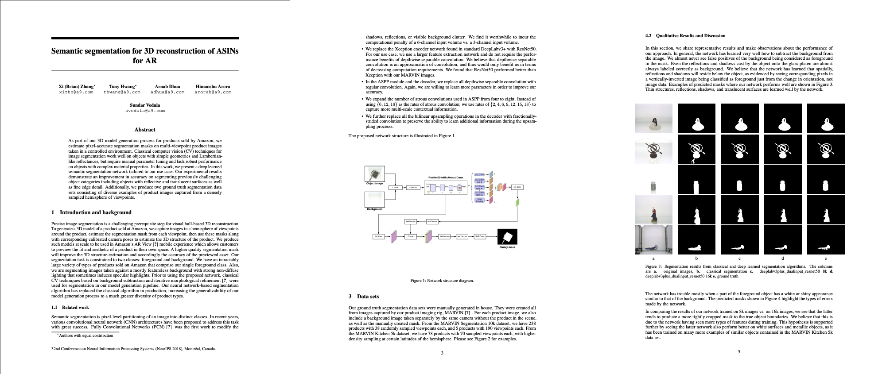

# MyDeeplabV3

## Overview
MyDeeplabV3 is a Python implementation of my paper, *["Semantic Segmentation for 3D Reconstruction of ASINs for AR"](https://github.com/xzhang311/MyDeeplabV3/blob/main/Deep_learned_image_segmentation.pdf).* This project leverages the DeepLabV3 architecture for semantic segmentation to support 3D reconstruction of objects (ASINs) for augmented reality (AR) applications. It focuses on accurately segmenting objects in images to facilitate high-quality 3D model generation.

## Features
- **Semantic Segmentation**: Utilizes DeepLabV3 for precise object segmentation in images.
- **3D Reconstruction Support**: Generates segmentation masks optimized for AR-ready 3D models.
- **Customizable Model**: Allows fine-tuning of DeepLabV3 for specific object categories.
- **Visualization Tools**: Includes utilities to visualize segmentation results.

## Preview


## Installation
1. Clone the repository:
   ```bash
   git clone https://github.com/xzhang311/MyDeeplabV3.git
   ```
2. Navigate to the project directory:
   ```bash
   cd MyDeeplabV3
   ```
3. Install dependencies:
   ```bash
   pip install -r requirements.txt
   ```

## Usage
Run the main script to perform semantic segmentation on an input image:
```bash
python main.py --input path/to/image.jpg --output path/to/segmentation_mask.png
```
Use the `--help` flag for detailed configuration options, including model weights and output formats:
```bash
python main.py --help
```

## Requirements
- Python 3.8+
- Libraries: PyTorch, torchvision, NumPy, OpenCV, Matplotlib (listed in `requirements.txt`)

## Reference
This project implements the methodology described in:
- *["Semantic Segmentation for 3D Reconstruction of ASINs for AR"](https://github.com/xzhang311/MyDeeplabV3/blob/main/Deep_learned_image_segmentation.pdf).*

## Contributing
Contributions are welcome! Please fork the repository, create a feature branch, and submit a pull request with your enhancements.

## License
This project is licensed under the MIT License. See the [LICENSE](LICENSE) file for details.

## Acknowledgments
This work is based on the DeepLabV3 architecture and research on semantic segmentation for 3D reconstruction in AR applications.
